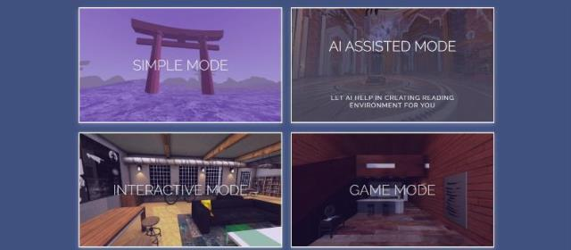
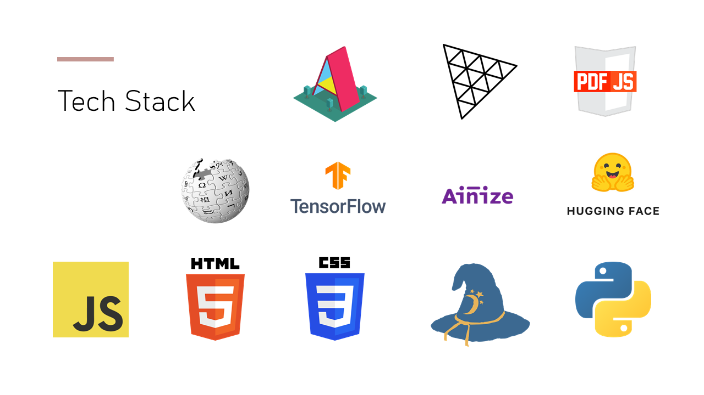

# Interactive Reading Environment in Web-Based Virtual Reality

### **Description / Rationale**
Virtual reality can be used for delivering information effectively, while fostering immersion. Reading applications created specifically in web-based virtual reality, can offer significant advantages: they can make virtual reality more accessible, because they are served over the web and are compatible with most if not all VR devices. 

The present project is about the reading platform that allows users to read their own pdf materials in web-based virtual reality setting that features both interactivity and playability, created thanks to various artificial intelligence/machine learning tools. 

### **Goals**
The goals of the project are: 
* To demonstrate new type of reading experience. 
* To demonstrate advanced capabilities of web VR.
* To create accessible VR reading experience.

### **Structure**
The reading platform offers 4 modes for reading: 

**1. User-generated reading environment (Simple Mode)** 
In this mode users can use their own 360 photos or choose the default 3D model of a room or select one of five 3d environments and then upload a pdf file. The respective sound will be added automatically based on random selection (for now there are three types of sound: arts, tale and culture). In addition, there is a possibility to apply weather effects and toggle sound.

**2. User + AI generated reading environment (Assisted Mode)** 
In this mode users are given option to select from two options: 
* They load their 360 photos and then .pdf file and computer vision identifies the photo and loads respective sound. For now there are 4 photo types, which can be identified: city, room, mountain, forest. On the back the task is Image Classification (created by using Tensorflow.js + ImageNet + Teachable Machine).
* They load a pdf file and AI powered algorithm identifies the category it belongs to (based on the first page of a pdf file) and loads respective 360 photo and sound. The following categories can be identified: computer, sports, biology, fairytale, society, politics, ecology, culture, cuisine, fishing, medicine.
On the back there is NLP task which is text classification (Zero-Shot Classification API through HuggingFace).
In addition, there is a possibility to apply weather effects and toggle sound. 

**3. Interactive Reading with AI and other tools (Interactive Mode)** 
In this mode the focus is on creation of assistive tools, which improve the reading experience. The respective sound will be added automatically based on random selection (for now there are three types of sound: arts, tale and culture). So, as soon as users load their .pdf file, they appear in the default environment with the following elements:
* **Text to speech.** Does not work in Oculus Browser. Enabled on click. On the back it uses Web Speech API
* **Speech to text.** Does not work in Oculus Browser. Enabled on click. On the back it uses Web Speech API
* **Keyboard.** Enabled on click
* **A Wikipedia article summary page.** Enabled if < 3 words are typed. Can be used to find out what particular term means. Appears to the left of the screen. On the back it is powered by Wikijs API.
* **Q & A system.** Enabled if > 3 words are typed in the form of a question. The question should be asked in relation to that particular pdf page. Appears to the left of the screen. On the back it is powered by Tensorflow.js QA model.
* **Text summatization.** Enabled on click. Can be used on every page to get a summary of the page. On the backend it uses Text Summarization Model API.  

**4. Game Environment (Game Mode)**
In this mode users will be able to generate a quiz game based on any page of a .pdf file. It takes a little bit of time to load this mode first. It contains the following elements:
* **Quiz generator.** On the back it uses Question Generator model, which works in combination with WordVectors, which help to generate distractors (wrong answers). Enabled on click.
* **Notebook.** Enabled on click. When no quiz is generated shows blank. Otherwise shows first five questions ans answers.
* **Export 3D.** Enabled on click. When notebook is not visible does not work. Generates 3D model of the notebook.

### **Tech Stack**
The following libraries/tools/frameworks used in the project:

### **Credits**

All icons used in this project were taken from <a href="https://www.veryicon.com/">VeryIcon.com</a> website
        with no attribution required.

      
Default 3D model of the room (used in simple mode and interactive mode) was created by <b>Francesco
          Coldesina</b>, and taken from <a
          href="https://sketchfab.com/3d-models/big-room-0b5da073be88481091dbef7e55f1d180">Sketchfab.com</a>

      
3D model of the winter loft (used in game mode) was created by <b>Elin</b>, and taken from <a
          href="https://sketchfab.com/3d-models/winter-loft-582e75361edb4e95b20df20c3a8681bf">Sketchfab.com</a>

      
All 360 photo assets (used in AI assisted mode) used in this project were taken from <a
          href="https://polyhaven.com/">PolyHeaven.com</a> website
        with no attribution required.

      
All sound assets (used in all modes) used in this project were taken from <a
          href="https://freesound.org/">FreeSound.org</a> website
        with no attribution required.

      
The following A-Frame components were used:  
        <a href="https://github.com/supermedium/aframe-environment-component">A-Frame Environment Component</a>,
        <a href="https://github.com/IdeaSpaceVR/aframe-particle-system-component">A-Frame Particle System Component</a>,
        <a href="https://github.com/supereggbert/aframe-htmlembed-component">A-Frame HTML Embed Component</a>,
        <a href="https://github.com/kikoano/web2vr">Web2VR Component</a>,
        <a href="https://github.com/fernandojsg/aframe-gltf-exporter-component">GLTF Exporter Component</a>,
        <a href="https://github.com/stemkoski/A-Frame-Examples/tree/master/js">Raycaster Extras, Player Move and
          Controller Listener by Lee Stemkoski</a>,
        <a href="https://github.com/WandererOU/aframe-keyboard">A-Frame Keyboard Component</a>.
      

      
The following libraries, plugins and APIs were used:
        <a href="https://aframe.io/">A-Frame (Web VR)</a>,
        <a href="https://mozilla.github.io/pdf.js/">Pdf.js (Pdf Rendering)</a>,
        <a href="https://www.tensorflow.org/js">Tensorflow.js (Q&A, Image Classification)</a>,
        <a href="https://teachablemachine.withgoogle.com/">Teachable Machine (Image Classification)</a>,
        <a href="https://ainize.ai/">question generation, text summarization (API)</a>,
        <a href="https://huggingface.co/">Zero-shot text classification (API)</a>,
        <a href="https://www.npmjs.com/package/wikijs">WikiJs (API)</a>.
      

### **Demo**
To see the application at work: [Demo application](https://www.vr-reader.com)
