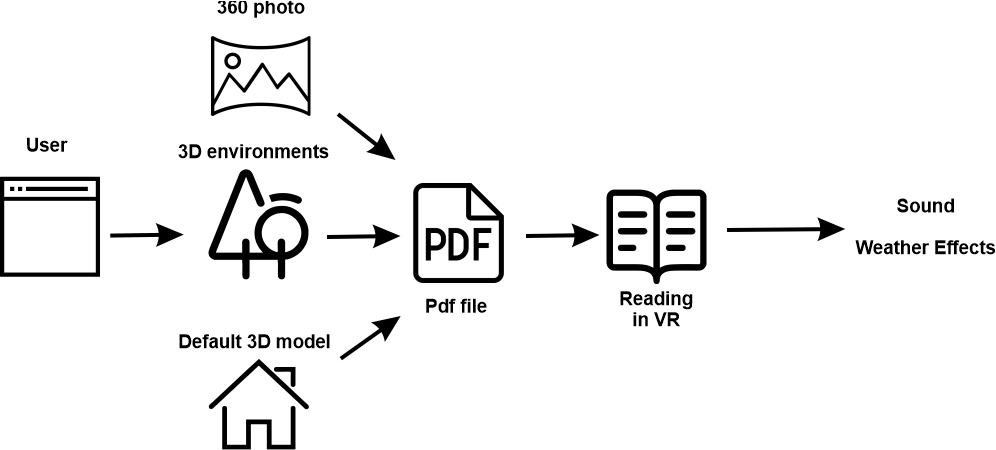
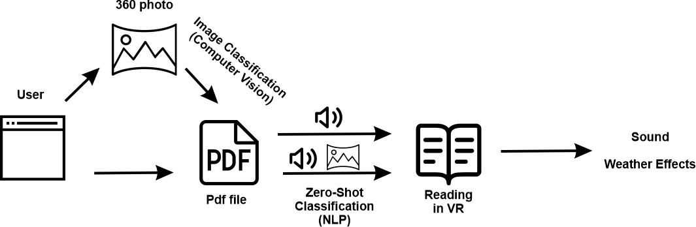

# Interactive Reading Environment in Web-Based Virtual Reality

### **Description / Rationale**
Virtual reality can be used for delivering information effectively, while fostering immersion. Reading applications created specifically in web-based virtual reality, can offer significant advantages: they can make virtual reality more accessible, because they are served over the web and are compatible with most if not all VR devices. 

The present project is about the reading platform that allows users to read their own pdf materials in web-based virtual reality setting that features both interactivity and playability, created thanks to various artificial intelligence/machine learning tools. 

### **Goals**
The goals of the project are: 
* To demonstrate new type of reading experience. 
* To demonstrate advanced capabilities of web VR.
* To create accessible VR reading experience.

### **Structure**
The reading platform offers 4 modes for reading: 

**1. User-generated reading environment (Simple Mode)** 
In this mode users can use their own 360 photos or choose the default 3D model of a room or select one of five 3d environments and then upload a pdf file. The respective sound will be added automatically based on random selection (for now there are three types of sound: arts, tale and culture). In addition, there is a possibility to apply weather effects and toggle sound.

**2. User + AI generated reading environment (Assisted Mode)** 
In this mode users are given option to select from two options: 
* They load their 360 photos and then .pdf file and computer vision identifies the photo and loads respective sound. For now there are 4 photo types, which can be identified: city, room, mountain, forest. On the back the task is Image Classification (created by using Tensorflow.js + ImageNet + Teachable Machine).
* They load a pdf file and AI powered algorithm identifies the category it belongs to (based on the first page of a pdf file) and loads respective 360 photo and sound. The following categories can be identified: computer, sports, biology, fairytale, society, politics, ecology, culture, cuisine, fishing, medicine.
On the back there is NLP task which is text classification (Zero-Shot Classification API through HuggingFace).
In addition, there is a possibility to apply weather effects and toggle sound. 

**3. Interactive Reading with AI and other tools (Interactive Mode)** 
In this mode the focus is on creation of assistive tools, which improve the reading experience. So, as soon as users load their .pdf file, they appear in the default environment with the following elements:
* **Text to speech.** Does not work in Oculus Browser. Enabled on click. On the back it uses Web Speech API
* **Speech to text.** Does not work in Oculus Browser. Enabled on click. On the back it uses Web Speech API
* **Keyboard.** Enabled on click
* **A Wikipedia article summary page.** Enabled if < 3 words are typed. Appears to the left of the screen. On the back it is powered by Wikijs.
* **Q & A system.** Enabled if > 3 words are typed in the form of a question. Appears to the left of the screen. On the back it is powered by Tensorflow.js QA model.
* **Text summatization.** 

**Web**
1. Copy the repository to your development environment.
2. Use "train.html" to train. Use "train.html" to train. Click on first button (idle) several times and train idle image. Click on second button several times (object1) and train second image and so on. 
3. After you are confident with the results save your image classification using transfer learning. A file will be generated with the name of "weights.json".
4. Refresh "train.html" page and load "weights.json" file to test if everything works ok.  
5. Put "weights.json" into the same folder, where this application is.
6. If test was successfull and previously trained images are recognized, put "weights.json" file into the same folder as the application on server. Use "load.html" file to load trained image classification.

### **Demo**
To see the application: [Demo application](https://transferlearning.glitch.me/train.html)
